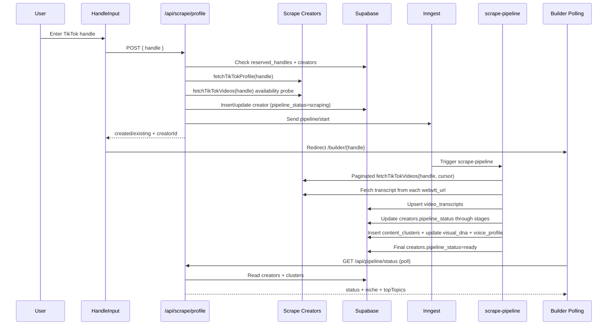

# Scrape Creators End-to-End Flow

This document explains exactly how this codebase uses Scrape Creators from TikTok username entry to pipeline completion.

## Scope

This covers all current Scrape Creators call sites:

- Initial onboarding profile bootstrap.
- Paginated video + transcript ingestion in the async pipeline.
- Storefront visual-DNA fallback thumbnail refresh.

## Main Entry Point (Username Input)

1. User enters a TikTok handle in [`src/components/landing/HandleInput.tsx`](src/components/landing/HandleInput.tsx).
2. Client normalizes input:
- removes `@`
- trims
- lowercases
3. Client-side regex check: `^[a-zA-Z0-9._]{1,24}$`.
4. Client sends `POST /api/scrape/profile` with `{ handle }`.
5. If successful, UI redirects to `/builder/{handle}`.

## Request Guardrails Before Scraping

### API validation

`/api/scrape/profile` validates body using `scrapeProfileSchema` in [`src/lib/validation/schemas.ts`](src/lib/validation/schemas.ts):

- `handle` required
- max length 50
- chars limited to `[a-zA-Z0-9._]`

Route then applies an additional stricter regex: `^[a-zA-Z0-9._]{1,24}$`.

### Rate limiting

Global API middleware in [`src/middleware.ts`](src/middleware.ts):

- `/api/scrape/profile`: 40 requests / 300s per IP+path key
- `/api/pipeline/start`: 20 requests / 600s

429 responses include `Retry-After` and `retryAfterSeconds`. Landing UI reads both.

### Reserved handles

`/api/scrape/profile` checks `reserved_handles` table first.

- If matched, returns `409` with: `This handle is reserved. Try a different one.`

## Exact `/api/scrape/profile` Flow

Defined in [`src/app/api/scrape/profile/route.ts`](src/app/api/scrape/profile/route.ts).

1. Normalize handle (`@` removed, lowercase, trimmed).
2. Check `reserved_handles`.
3. Define `verifyHandleAvailability()`:
- calls `fetchTikTokVideos(handle)`
- if Scrape Creators deterministically reports missing/private (`AppError` 404), bubble error immediately
- for transient provider failures, return `null` so async pipeline retry path can handle later
4. Check existing creator by `handle`.
5. Branches:
- If existing and `is_claimed = true`: return existing record (`exists: true`), do not create new row.
- If existing and unclaimed: run `verifyHandleAvailability()`, return existing record (`created: true`).
- If not existing:
  1. call `fetchTikTokProfile(handle)`
  2. require profile with `nickname`
  3. run `verifyHandleAvailability()` and compute `normalizedVideoCount = max(profile.video_count, firstPageVideoCount || 0)`
  4. best-effort persist avatar into Supabase Storage (`persistImageToStorage`)
  5. insert creator row with `pipeline_status = 'scraping'`
  6. handle unique race (`23505`) by reading winner row
  7. send Inngest event: `pipeline/start` with `creatorId` + `handle`
  8. return `{ created: true, creatorId, creator }`

## Scrape Creators Adapter Details

Implemented in [`src/lib/scraping/scrapeCreators.ts`](src/lib/scraping/scrapeCreators.ts).

### Base config

- Base URL: `https://api.scrapecreators.com`
- API key env: `SCRAPECREATORS_API_KEY` (required)
- Header for provider requests: `x-api-key`

### Endpoint usage

1. Profile endpoint
- `GET /v1/tiktok/profile?handle={handle}`
- wrapper: `fetchTikTokProfile(handle)`

2. Videos endpoint
- `GET /v3/tiktok/profile/videos?handle={handle}[&max_cursor=...]`
- wrapper: `fetchTikTokVideos(handle, cursor?)`

3. Transcript fetch
- direct `fetch(webvtt_url)` from each video payload
- wrapper: `fetchVideoTranscript(webvttUrl)`

### Normalization logic

Profile/video payloads are normalized across multiple possible provider shapes:

- supports nested wrappers (`data`, `user`, `stats`, `aweme_list`, etc.)
- normalizes numeric strings to numbers
- normalizes cursor number/string to string
- resolves thumbnail from multiple fields and prefers non-HEIC candidates
- extracts transcript URLs from caption/subtitle structures

### Provider error mapping

`mapProviderFailure()` converts provider responses into `AppError` with user-safe messaging.

- not found/private signals: throws `404` (`Could not find that TikTok account...`)
- provider 404 endpoint/path issue: throws `503` temporary unavailable
- credits exhausted (`402` or message classification): throws `503`
- rate limit (`429`): throws `429`
- auth/key issues (`401/403`): throws `503`
- provider 5xx: throws `503`
- unexpected non-5xx: throws `502`

Network-level fetch failures are converted to `503` temporary unavailable.

## Async Pipeline After Username Submission

The pipeline function is in [`inngest/functions/scrape-pipeline.ts`](inngest/functions/scrape-pipeline.ts), registered at [`src/app/api/inngest/route.ts`](src/app/api/inngest/route.ts).

Triggers:

- `pipeline/start` sent from `/api/scrape/profile`
- `pipeline/start` can also be sent manually by `/api/pipeline/start`

Function config:

- Inngest function id: `scrape-pipeline`
- retries: `2`

### Stage-by-stage behavior

1. Set creator status to `scraping`.

2. PASS 0A `scrape-videos` (Scrape Creators call)
- loops `fetchTikTokVideos(handle, cursor)`
- dedupes by `video.id`
- hard cap: `MAX_PIPELINE_VIDEOS = 180`
- continuation guard via `getScrapeContinuationDecision()`:
  - stop if provider says no more
  - missing next cursor
  - repeated cursor
  - page added 0 new videos
  - page limit reached (`20`)
  - video limit reached (`180`)
  - scrape duration exceeded (`120000ms`)
- broadcasts progress on channel `pipeline:{creatorId}`

3. PASS 0B `fetch-transcripts` (Scrape Creators transcript URL consumption)
- batch size: 20 videos
- for each video:
  - if `webvtt_url` exists, fetch transcript text
  - fallback to `description` or `title` if transcript unavailable/too short
  - skip if resulting text < 10 chars
- dedupe transcript rows by `video_id` (keep longest transcript)
- upsert into `video_transcripts` with conflict key `(creator_id, video_id)`
- if transcript rows < 5:
  - set creator status `insufficient_content`
  - broadcast insufficient progress

4. PASS 1 `clean-transcripts`
- sets creator status `cleaning`
- uses Gemini Flash to clean transcript batches (size 30)

5. PASS 2 `cluster-content`
- sets creator status `clustering`
- uses Gemini Flash to return 5-12 product-ready clusters

6. PASS 2.5 `extract-visual-dna`
- builds visual DNA mostly from top thumbnail URLs + OpenAI fallback
- writes `creators.visual_dna`

7. PASS 3 `extract-content`
- sets creator status `extracting`
- uses GPT-4.1 to extract structured cluster knowledge
- writes `content_clusters`
- aggregates `voice_profile` with GPT-4.1-nano and writes to `creators.voice_profile`

8. Completion
- sets creator status `ready`
- clears `pipeline_error`
- broadcasts `ready/completed`

9. Error path
- on exception: set creator status `error`, write `pipeline_error`, broadcast error, rethrow for Inngest retry/failure tracking

## What Gets Persisted (Scrape-Relevant)

1. `creators`
- profile data from Scrape Creators profile endpoint
- `pipeline_status`, `pipeline_error`
- `visual_dna`, `voice_profile` from downstream passes

2. `video_transcripts`
- one row per `(creator_id, video_id)` from Scrape Creators video pages + transcript URLs
- includes metrics, thumbnail URL, transcript text, and metadata

3. `content_clusters`
- clustered/extracted output derived from scraped transcript corpus

## Exact Save Operations (Field-Level)

### A) Initial creator save (`/api/scrape/profile`)

For new creators, `insert` into `creators` writes:

- `handle`
- `display_name` (from normalized profile `nickname`)
- `avatar_url` (prefers persisted Supabase storage URL; falls back to provider URL)
- `bio`
- `follower_count`
- `following_count`
- `video_count` (`max(profile.video_count, firstPageVideoCount)`)
- `is_verified`
- `tiktok_url`
- `pipeline_status = 'scraping'`

If the insert hits unique conflict (`23505`), route fetches existing row and returns it.

### B) Transcript save (`scrape-pipeline` PASS 0B)

Pipeline builds transcript rows per video, then:

1. Dedupes by `video_id` via `dedupeTranscriptRows()` (keeps longest transcript text).
2. `upsert`s into `video_transcripts` with `onConflict: 'creator_id,video_id'`.
3. Each saved row includes:
- `creator_id`
- `video_id`
- `platform = 'tiktok'`
- `title`
- `description`
- `views`
- `likes`
- `comments`
- `shares`
- `thumbnail_url`
- `transcript`
- `webvtt_url`
- `duration_seconds`
- `posted_at`

If fewer than 5 transcript rows survive, status is set to `insufficient_content`.

### C) Cluster save (`scrape-pipeline` PASS 3)

Pipeline first deletes old cluster rows for creator, then inserts new rows in `content_clusters`:

- `creator_id`
- `label`
- `topic_summary`
- `video_ids`
- `total_views`
- `video_count`
- `extracted_content`
- `recommended_product_type`
- `confidence_score`

### D) Creator enrichment saves

During/after pipeline:

- `creators.visual_dna` updated in visual DNA pass.
- `creators.voice_profile` updated after voice-marker aggregation.
- terminal status writes:
  - success: `pipeline_status = 'ready'`, `pipeline_error = null`
  - failure: `pipeline_status = 'error'`, `pipeline_error = <message>`

## Brand DNA: Profile Pic vs Thumbnail DNA (Important Distinction)

There are two separate mechanisms:

### 1) Profile-pic color extraction (accent hint, not persisted as `visual_dna`)

In builder onboarding (`builder-store`):

- Client reads creator `avatar_url`.
- Runs `extractDominantColor(avatar_url)` in browser canvas.
- Stores result in client store as `avatarDominantColor`.
- Sends it to `/api/generate/storefront` as `avatarColorHint` for template rendering.

Template palette logic (`resolvePalette`) uses:

- accent color priority: `avatarColorHint` -> `visual_dna.accent_color` -> default

This path personalizes the initial storefront accent, but does **not** write `creators.visual_dna`.

### 2) Thumbnail-derived visual DNA (persisted creator Brand DNA)

In `scrape-pipeline` PASS 2.5:

- Selects top thumbnail URLs from clustered high-signal videos.
- Extracts palette/signals from thumbnails.
- Optionally refines with OpenAI composite-image pass.
- Writes final object to `creators.visual_dna`.

This is the persistent Brand DNA used across storefront/product generation.

## Builder Side: From Redirect to "Done"

Builder flow is in [`src/stores/builder-store.ts`](src/stores/builder-store.ts).

1. Builder page loads creator from DB (`/builder/[handle]`).
2. Onboarding begins.
3. If pipeline not already running/ready, client calls `POST /api/pipeline/start`.
4. Client polls `GET /api/pipeline/status?creatorId=...` every 3s (then 6s on long runs).
5. Terminal handling:
- `ready`: analysis complete, then storefront generation flow continues.
- `error` or `insufficient_content`: onboarding shows error message.

`/api/pipeline/status` also returns:

- `status`
- `error`
- `niche` (detected from creator bio)
- `topTopics` (from top `content_clusters`)

## Secondary Scrape Creators Usage (Outside Initial Pipeline)

In [`src/app/api/generate/storefront/route.ts`](src/app/api/generate/storefront/route.ts):

- if creator visual DNA is missing/placeholder, system first tries stored transcript thumbnails
- if still not enough, it calls `fetchTikTokVideos(creator.handle, cursor)` for up to 2 pages to refresh thumbnail URLs
- these thumbnails are used to rebuild visual DNA

This is the only non-pipeline Scrape Creators call after onboarding.

## Sequence Diagram

## Important Current Behavior Notes

1. `src/lib/scraping/pipeline.ts` (`collectCreatorTranscripts`) is present but currently unused.
2. Middleware rate limits are in-memory `Map` based, so counters are per-process (not shared across instances).
3. Pipeline sets `insufficient_content` in inner steps, but currently still executes final `ready` write unless an error is thrown. That means `insufficient_content` may be transient rather than final in some runs.
